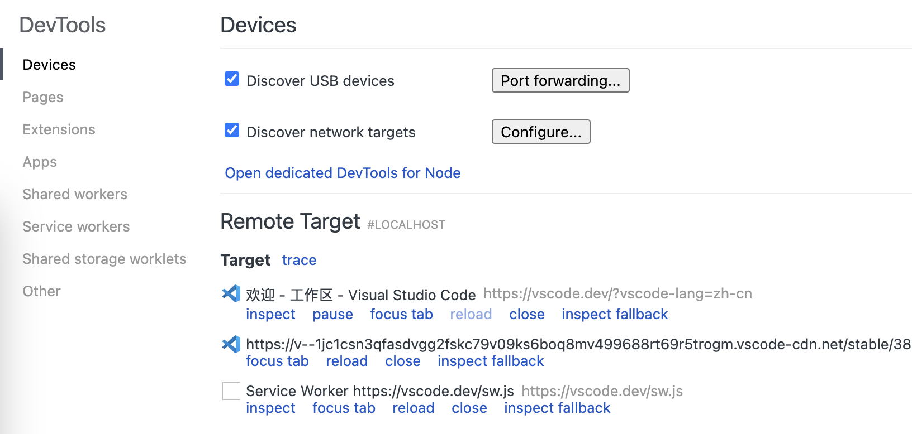

# HarmonyOS Flutter uses DevTools to debug webviews

Integrating Webview in Harmony Flutter Development describes how to integrate Webview in Flutter. This article describes how to debug a webview.

## Configure the webview

CustomView.ets file, configure the allowed debugging at lifecycle aboutToAppear:

```ets
  aboutToAppear() {
    webview.WebviewController.setWebDebuggingAccess(true);
  }
```

## Locate the port of devtools

Run the app, use the hdc command to connect the device, and find the relevant port

```bash
# Connect the device
hdc shell

# Locate the relevant process
cat /proc/net/unix | grep devtools

#0: 00000002 0 10000 1 1 2318187 @webview_devtools_remote_43406
#0: 00000002 0 10000 1 1 20785 @webview_devtools_remote_6312
```

As you can see above, webview_devtools_remote_43406 is the page we want to debug

## Enable port forwarding

Forward the ports in the device to the development computer

```bash
hdc fport tcp:9222 localabstract:webview_devtools_remote_43406

# Forwardport result:OK
```

## Find the webview in Chrome and start debugging

Open the 'chrome://inspect/#devices' page in Chrome and observe the relevant page at RemoteTarget

Select the page to be scheduled, click inspect, and the DevTools window will pop up to open page scheduling



<!--  -->

## Miscellaneous

If you want to inject js code into a webview, you can inject a JavaScript script using the 'runJavaScript' method in the web component configuration, such as

```ets
    Web({src: 'https://baidu.com', controller: this.webviewController})
      .domStorageAccess(true)
      .fileAccess(true)
      .mixedMode(MixedMode.All)
      .databaseAccess(true)
      .javaScriptAccess(true)
      .onPageEnd(() => {
          this.webviewController.runJavaScript("document.querySelector('meta[http-equiv=\"Content-Security-Policy\"]').remove()");
      })
```

## References

- [ArkWeb API](https://developer.huawei.com/consumer/cn/doc/harmonyos-references-V5/arkweb-api-V5)
- [Introduction to ArkWeb](https://developer.huawei.com/consumer/cn/doc/harmonyos-guides-V5/arkweb-V5)