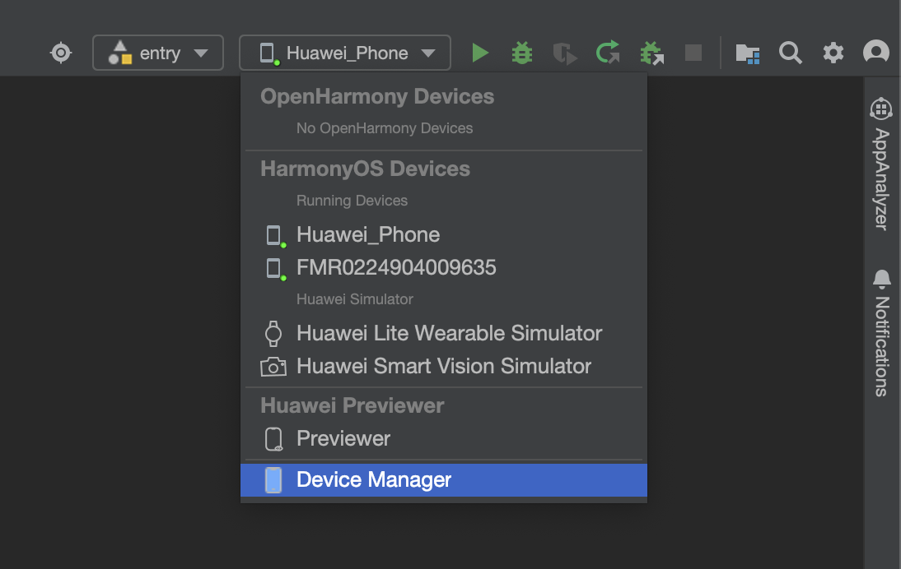
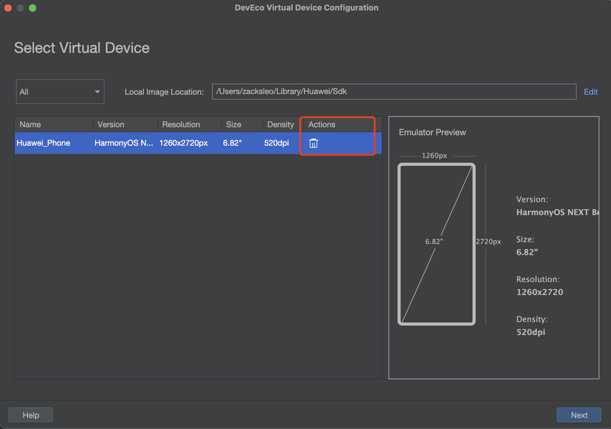

# HarmonyOS Flutter in action: Use the simulator to develop and debug

## SDK before selection

- ohos-3.7, X86 emulators can be used
- ohos-3.22, requires an emulator for MAC computers with ARM architecture

## Create a project

After the development environment is set up, use the flutter create command to create the project

### New project

```bash
flutter create --platforms ohos ohos_app
```

### Added HarmonyOS platform support for old projects

```bash
flutter create --platforms ohos .
```

## Signature

Use DevEco to open the ohos directory in the above project, which is our HarmonyOS project directory

Open 'File' -> 'Project Structure...', click 'Siging Configs', check Automatically generate signature,

Click 'Sign In', log in to your HUAWEI ID, and click 'Apply', 'OK', and sign the sign in the lower right corner.

Observe that the console outputs a prompt 'Process finished with exit code 0'

```bash
> hvigor WARN: The current module 'ohos' has dependency which is not installed at its oh-package.json5.
> hvigor Finished :entry:init... after 1 ms
> hvigor Finished ::init... after 1 ms

Process finished with exit code 0
```

## Create a simulator

1. Open Device Manager in DevEco (it can be found from the drop-down to the left of the Run button in the upper right corner)



2. Click '+ New Emulator' in the lower right corner, pop up the emulator selection window, if the image has not been downloaded, a download button will appear at the box, click Download first, click 'Next' to create the emulator after the download is completed, and then click 'Previous' to create successfully



3. Go back to the emulator list window, the new emulator appears in the list, click the 'Run' button, and the emulator will run successfully.

## Movement Flutter project

The device of the emulator should appear in the bottom right corner of the VSCODE, as shown in the line '127.0.0.1:5555(ohos-arm64)', if it does not appear in Note 2.

Go back to the Flutter project in Vscode, like the normal flutter project, and click the Run button.

## Precautions

### 1. Flutter runs the App, the package is installed successfully, and the Run Flashback Check from the following aspects:

1.1 If you are an emulator with x86 computer architecture, try removing the FloatingActionButton in main.dart
1.2 If the Flutter SDK is using ohos-3.22, try to turn off the 'impeller' rendering mode, open or create the file 'ohos/entry/src/main/resources/rawfile/buildinfo.json5', and add the following configuration

```json
{
"string": [
{
"name": "enable_impeller",
"value": "true"
}
]
}
```

### 2. The emulator device is not displayed in VSCode

2.1 Try to use Deveco to open the ohos directory (i.e., the HarmonyOS project file) of the project, and wait for the initialization analysis to be successful
2.2 Try restarting VSCode

3. When using fvm, flutter --version in the project directory is displayed incorrectly, not the ohos version

Try one by one in the following ways until you succeed.

3.1 Try running 'fvm use custom_3.22.0' on the vscode command line, and then create a .vscode/setting.json file and add a configuration like this to it

```json
{
"dart.flutterSdkPath": ".fvm/versions/custom_3.22.0"
}
```

A directory file like .fvm/version/custom_3.22.0 appears in the root directory of the project, and a '.fvmrc' file appears in the root of the project, similar to the following

```json
{
"flutter": "custom_3.22.0"
}
```

3.2 Try to restart the command line of VsCode, or restart the entire VsCode, and after reopening the VSCode command line, 'flutter --version' will show this output

```bash
Flutter 3.22.0-ohos • channel oh-3.22.0 • https://gitee.com/harmonycommando_flutter/flutter.git
Framework • revision 85630b0330 (13 days ago) • 2024-10-26 02:39:47 +0000
Engine • revision f6344b75dc
Tools • Dart 3.4.0 • DevTools 2.34.1
```

3.3 Turn off the global flutter configuration

In '~/.zshrc' or '~/.bash_profile', delete or comment out configurations like this and restart the command line/VSCode

```bash
#export PATH="/Users/zacksleo/flutter/bin:$PATH"
```
