# Packaging and Launching Process for HarmonyOS Applications

## Create an app

### Create a new project

1. In AppGalleryConnect, Go to My Projects, Add Project.

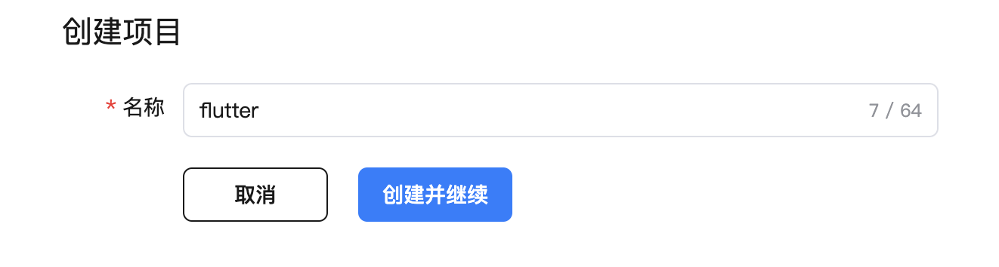

### Create a new APP ID

1. In AppGalleryConnect, Certificates, APP IDs, and Profiles.

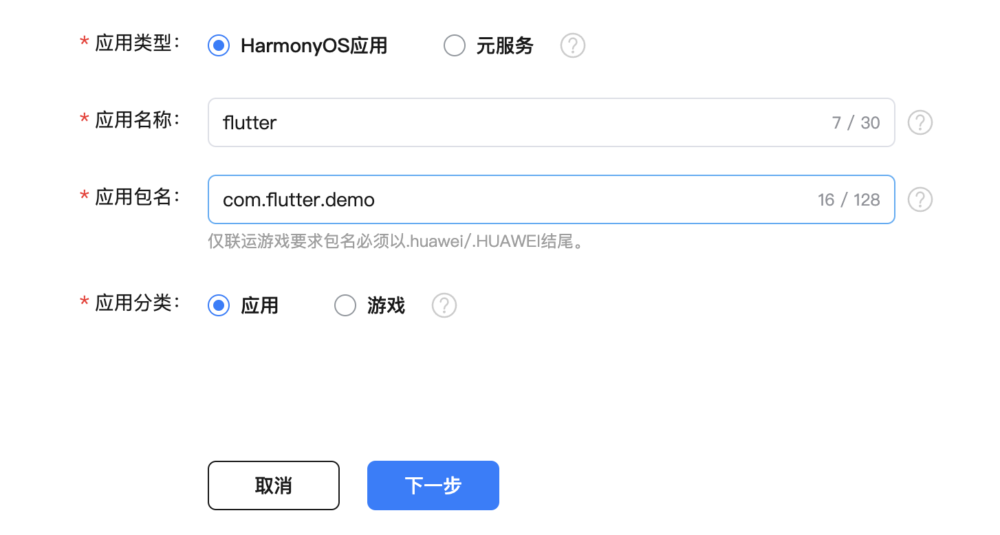

Select the project to which it belongs

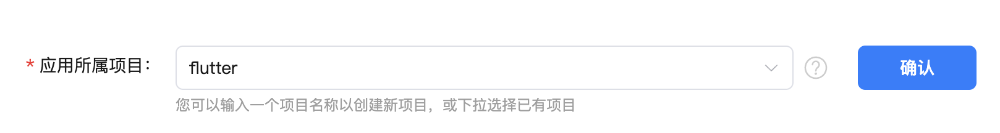

### Create an application/meta service

On the right side of the APP ID, click 'Publish', and the HarmonyOS app/meta service will pop up

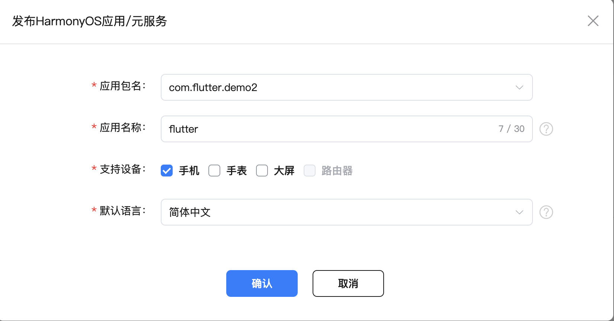

Fill in the application information as prompted, upload the app icon, select the app category and tag, and click Next

Upload the packaged app (see below).

Fill in the application information, company information, etc. It should be noted that apps need to provide soft works, while meta services do not.

## Package Signature

### Auto-signing

If you're developing and testing, you can use auto-signing. (File -> Project Structure -> Signing Configs check Automatically generate signature)

### If it's packaged and put on the shelves, you need to sign it manually

#### Open Deveco and do the following

1. Click Build > Generate Key and CSR in the main menu bar

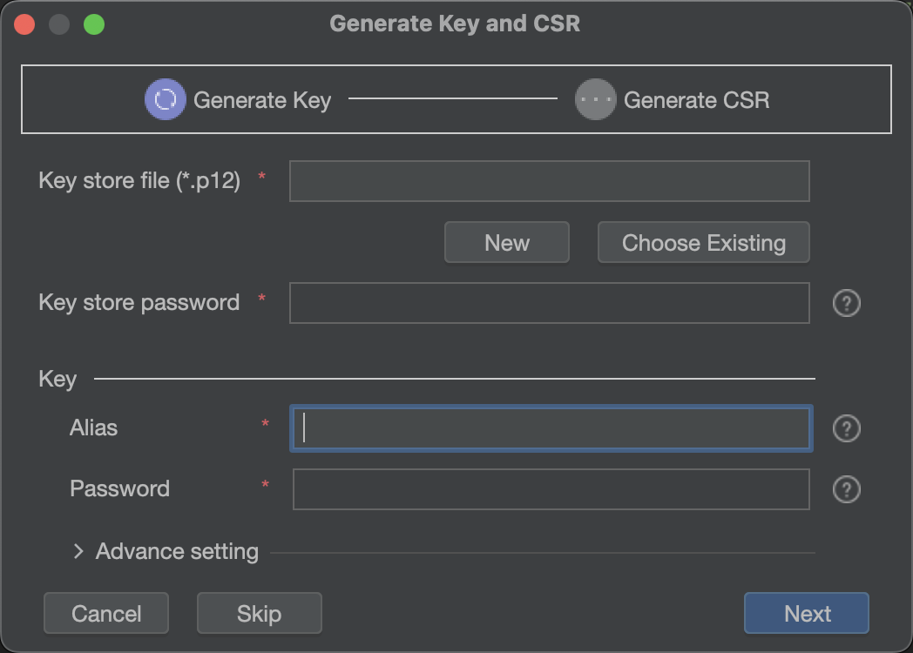

2. If you don't create a Key Store, click New to create one

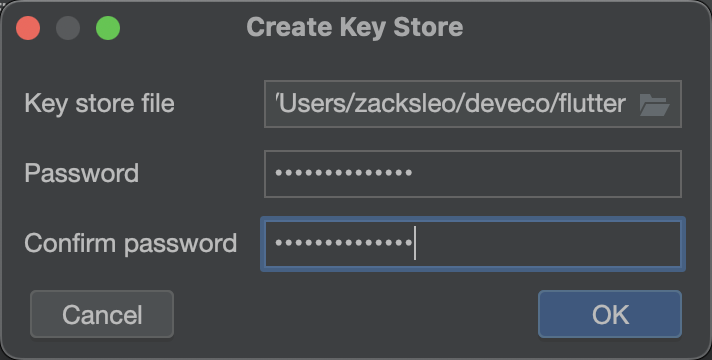

Select the directory you want to save (use .p12 for the file extension), enter a complex password with more than 8 digits of password, and click OK.

3. Set an alias for the key

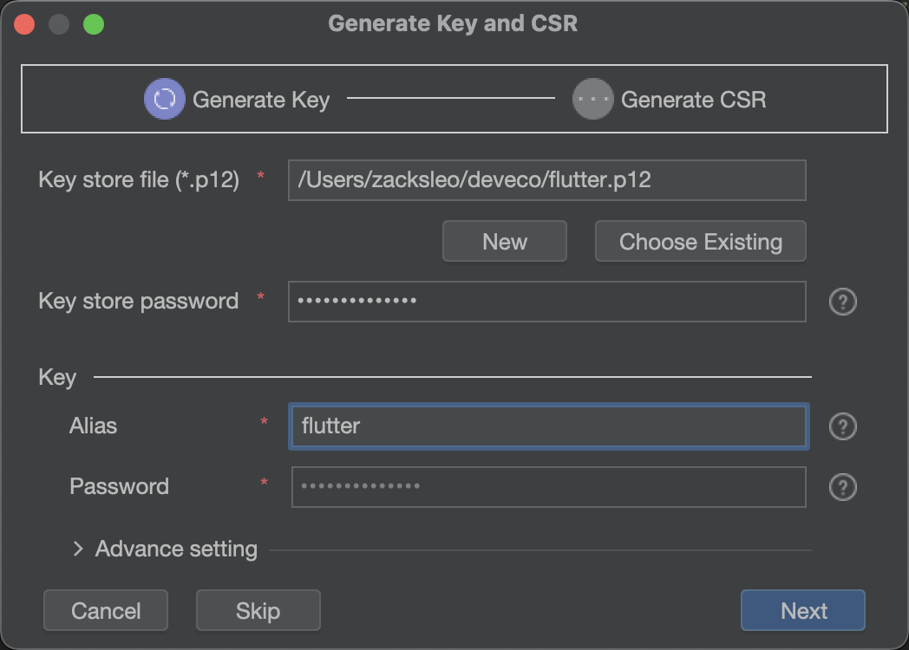

Click Next to proceed to the next step

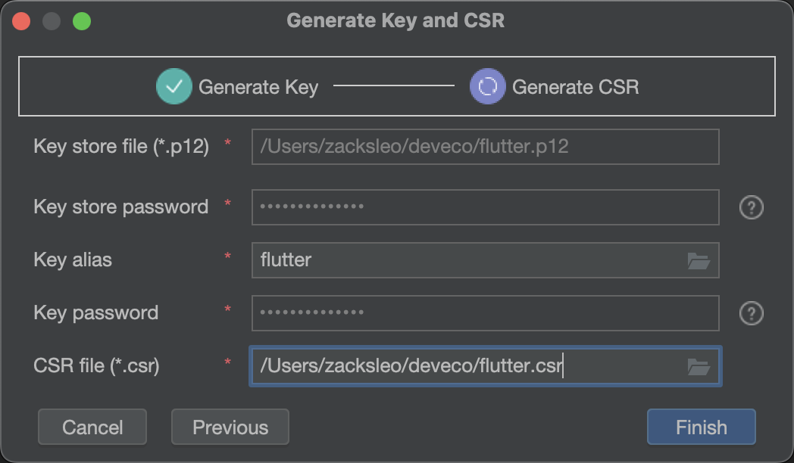

Set the CSR storage location, and make sure that the file name needs to be extended with '.csr'.

Clicking Finished will create a '.p12' keystore file and a certificate request '.csr' file.

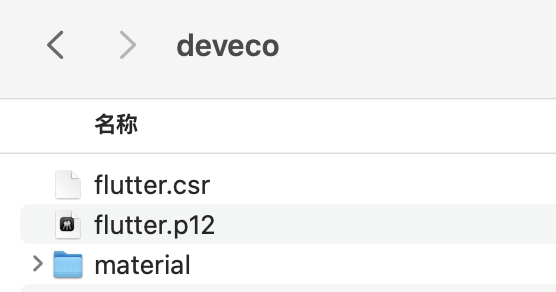

#### Log in to AppGallery Connect(https://developer.huawei.com/consumer/cn/service/josp/agc/handleAllianceLogin.html?_=20241104164846) and perform the following operations

1. Click 'Certificates, App IDs, and Profile', in the 'Certificates' column, click 'Add Certificate', upload the CSR file created above, and a 'cer' file will be generated.

Click the download button to save the certificate file for the APP to be packaged and used.

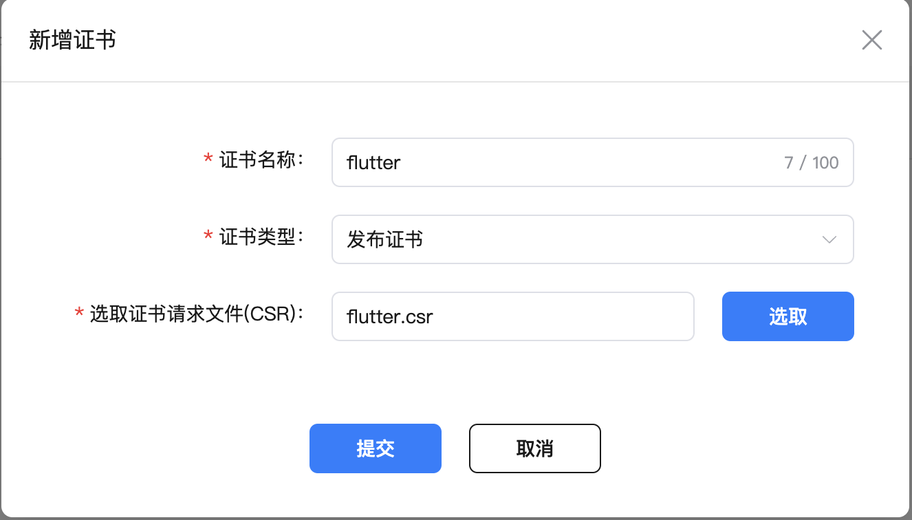

2. In the 'Profile' column of 'Certificates, App IDs, and Profiles', click Add, create a Profile file, and select the certificate you just created

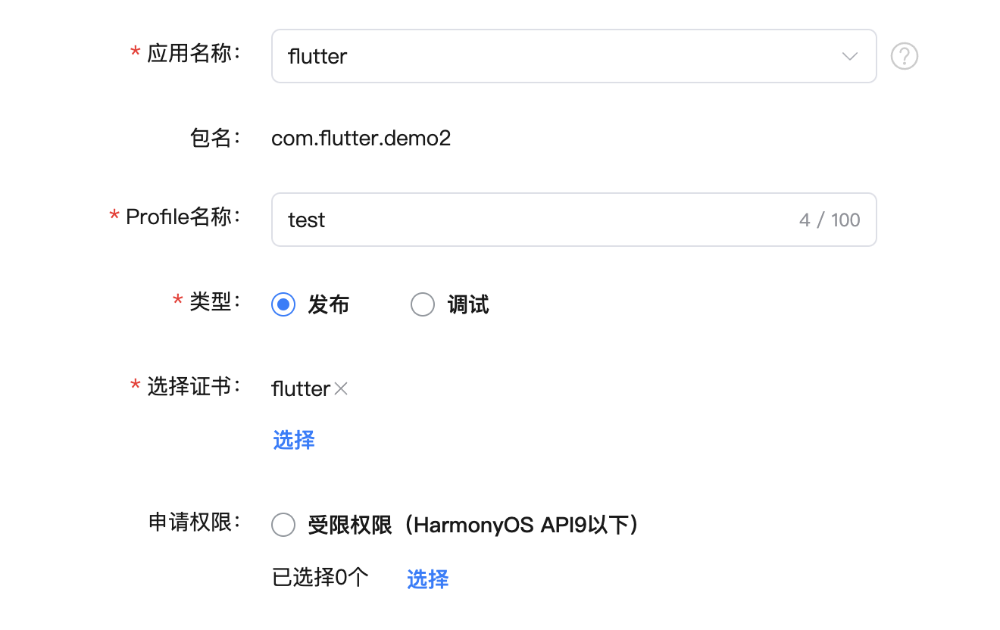

### Package your app

In Deveco, open File -> Project Structure -> Signing Configs, there will be a created default signing configuration by default, click the Add button,

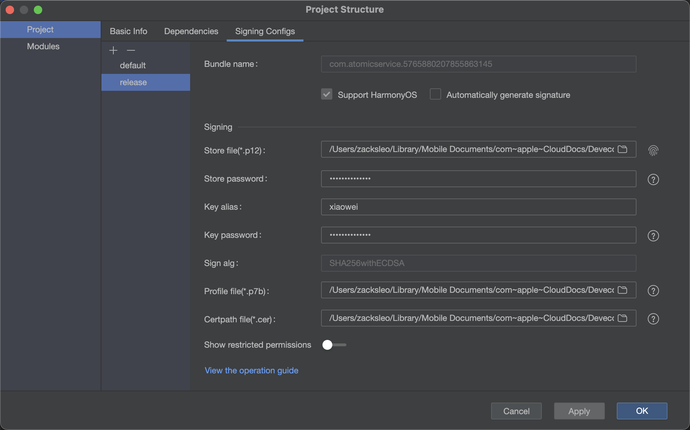

To do this, select the .p12 file created above, . p7b file, and the downloaded .cer file, enter the password, and click 'Apply' to generate the configuration.

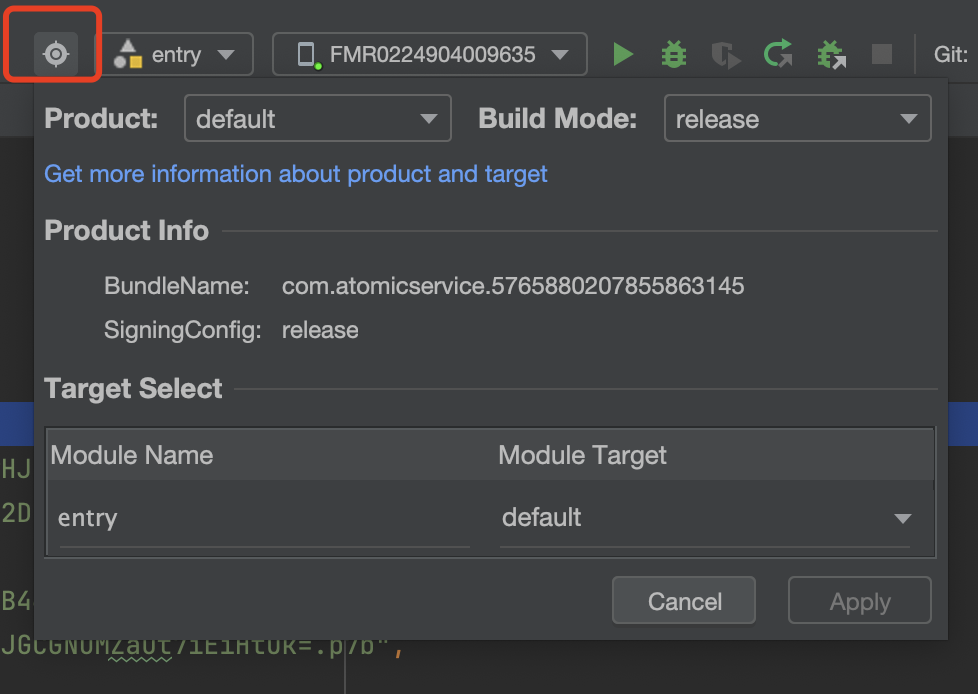

Click on the 'Product' 🔘 button in the red box, select release for Build model, and configure which signature to use in the build-profile.json5 file

```json
    "products": [
      {
        "name": "default",
        "signingConfig": "release",
      }
    ]
```

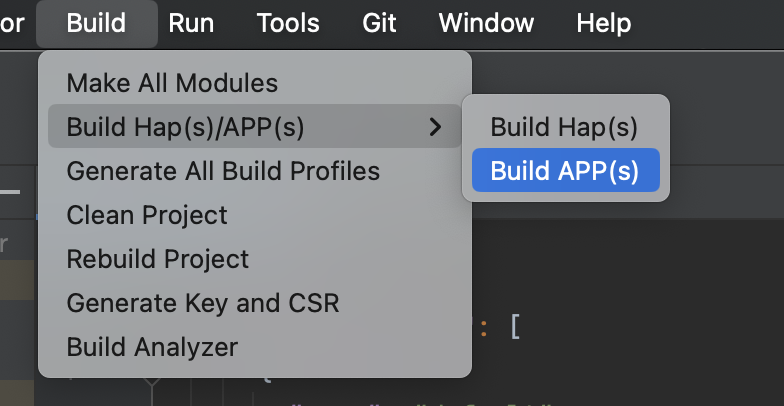

Click Build-> Build Hap(s)/APP(s) and select Build APP(s) to start the app packaging.

After the packaging is successful, the .app file will be generated in the build/outputs/default of the root directory of the project, which is the package we want to upload in the app market

## Frequently Asked Questions

'The package resolution failed, click the error code in the package management list for details, please follow the instructions to repackage and upload. `
'993,Profile file is illegal'

Check the signing profile to see if the release configuration is used

build-profile.json5

As shown in the configuration below, two signature configurations have been added here, one for development scheduling and one for packaging and shelf

```json
    "signingConfigs": [
      {
        "name": "default",
        "type": "HarmonyOS",
        "material": {
          "certpath": "xx",
          "storePassword": "xxx.cert",
          "keyAlias": "debugKey",
          "keyPassword": "xxx",
          "profile": "xxx.p7b",
          "signAlg": "SHA256withECDSA",
          "storeFile": "xxx.p12"
        }
      },
      {
        "name": "release",
        "type": "HarmonyOS",
        "material": {
          "certpath": "xx",
          "storePassword": "xxx.cert",
          "keyAlias": "release",
          "keyPassword": "xxx",
          "profile": "xxx.p7b",
          "signAlg": "SHA256withECDSA",
          "storeFile": "xxx.p12"
        }
      }
    ],
    "products": [
      {
        "name": "default",
        "signingConfig": "release",
        "compatibleSdkVersion": "5.0.0(12)",
        "runtimeOS": "HarmonyOS",
        "buildOption": {
          "strictMode": {
            "caseSensitiveCheck": true,
            "useNormalizedOHMUrl": true
          }
        }
      }
    ],
```

When packaging and listing, you need to make sure that the signingConfig above uses the signature configuration with the name 'release'

## References

- [App/Service Signature] (https://developer.huawei.com/consumer/cn/doc/harmonyos-guides-V5/ide-signing-V5)
