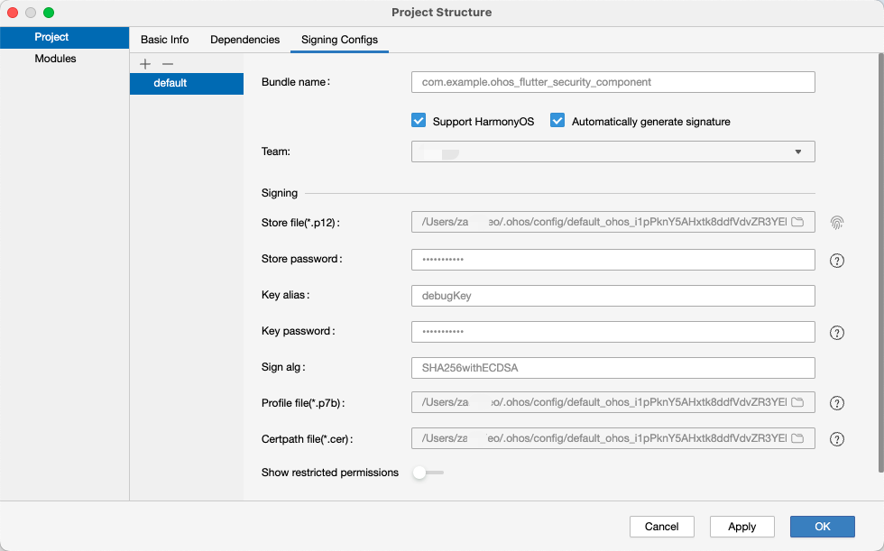
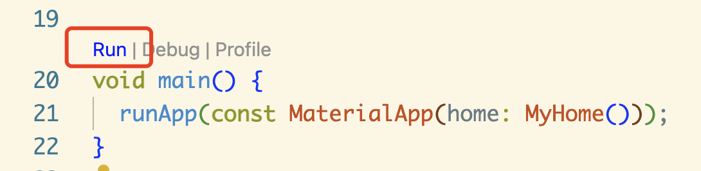

> This article describes how to develop HarmonyOS native apps with Flutter. The whole process combines previous articles, practical experience, and process optimization, and the experience is silky and painless.

## Painless development environment

> In order to reduce pain, it is developed using the globally unique version of Flutter. For advanced usage, please refer to the previous articles in the same series.

### Hardware preparation

One Mac, one Mate60 Pro, two monitors.

> HarmonyOS Flutter SDK developers love to use Mac, and they don't have to worry about using the same device (Arm version of Mac is preferred, X86 is also OK, and the system is not too old).

> Reviewers love the Mate60 series and choose the same model without worry.

> There are two monitors, put other people's code on the left side, and your own on the right side, for easy reference (copy and paste).

## Environment preparation

### Download DeEco
Go to the Huawei Developer Alliance website, https://developer.huawei.com/consumer/cn/download/, and click Download according to the computer model.

### Download the Flutter SDK

```bash
# Create the directory ~/.fvm/versions
mkdir -p ~/.fvm/versions

# Clone the Flutter SDK
git clone https://gitee.com/harmonycommando_flutter/flutter.git custom_3.22.0
```
### Configure environment variables

Open '~/.bash_profile' and add the following

```bash
# Flutter Mirror
export PUB_HOSTED_URL=https://pub.flutter-io.cn
export FLUTTER_STORAGE_BASE_URL=https://storage.flutter-io.cn

# HarmonyOS SDK
export TOOL_HOME=/Applications/DevEco-Studio.app/Contents/
export DEVECO_SDK_HOME=$TOOL_HOME/sdk # command-line-tools/sdk
export PATH=$TOOL_HOME/tools/ohpm/bin:$PATH # command-line-tools/ohpm/bin
export PATH=$TOOL_HOME/tools/hvigor/bin:$PATH # command-line-tools/hvigor/bin
export PATH=$TOOL_HOME/tools/node/bin:$PATH # command-line-tools/tool/node/bin

export PATH="~/.fvm/versions/custom_3.22.0/bin:$PATH"
```

After the configuration is complete, close the command line tool and reopen it for it to take effect. Use the 'flutter doctor' command to see if there is the word '3.22.0-ohos'.

## Create a project

Use the following command to create a project

```bash
flutter create --platforms ohos .
```

## Configure auto-signing

Open the project with Deveco and connect your Mate60 Pro phone to your computer (required).

Open 'File -> Project Structure -> Signing Configs' and check 'Automatically generate signature'.

Click 'Apply' to apply and 'OK' to complete the signing. At this point, you can turn off DevEco.



## Run the project

1. Use the Flutter run command, or in the IDE, click the Run button

```bash
# Check the device number
futter devices
```

The following similar output appears

```bash
Found 3 connected devices:
FMR0224904009635 (mobile) • FMR0224904009635 • ohos-arm64 • Ohos OpenHarmony-5.0.1.115 (API 13)
macOS (desktop) • macos • darwin-x64 • macOS 14.6.1 23G93 darwin-x64
Chrome (web) • chrome • web-javascript • Google Chrome 131.0.6778.108
```

Locate the ID of the HarmonyOS device, which is FMR0224904009635 as shown above.

```bash
# Run
flutter run -d FMR0224904009635
```

2. In the IDE, click the Run button, and here is the entry point in VsCode

> Make sure the Code Runner plugin is installed



## References

- [Harmony Flutter Practice: 01-Build Development Environment](./Harmony Flutter Practice: 01-Build Development Environment.md)
- [Harmony Flutter Practice: 02-Windows Environment Building Pit Guide](./Harmony Flutter Practice: 02-Windows Environment Building Pit Guide.md)
- [Harmony Flutter Practice: 11 - Use FlutterSDK3.22.0] (./Harmony Flutter Practice: 11 - Use Flutter SDK 3.22.0.md)
- [Harmony Flutter Practice: 12 - Use Simulator Development and Debugging](./Harmony Flutter Practice: 12 - Use Simulator Development and Debugging.md)
- [Harmony Flutter Practice: 13-Harmony Application Packaging and Listing Process](./Harmony Flutter Practice: 13-Harmony Application Packaging and Listing Process.md)
- [Harmony Flutter Practice: 14 - Existing Flutter Project Support Harmony II] (./Harmony Flutter Practice: 14 - Existing Flutter Project Support Harmony II.md)