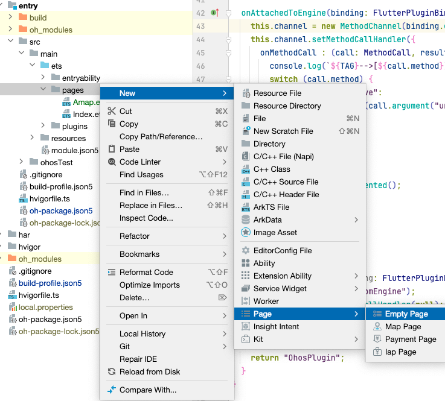

## Introduction

In the previous article [Existing Flutter project supports HarmonyOS II] (https://gitee.com/zacks/flutter-ohos-demo), we described how to use third-party plugins, and gave a lot of use cases, such as:
flutter_inappwebview, video_player, image_picker, etc., this article will begin to introduce how to integrate AutoNavi Map.

## Overall Solution

Communicate messages through MethodChannel, call native APIs on the Dart side, and jump to the specified page based on the parameters after receiving the relevant calls on the ArkTS side

## Dart side

```dart
  static Future<dynamic> redirectNative(String url) {
    return _methodChannel.invokeMethod("redirectNative", {
      "url": url,
    });
  }
```

## ArkTS side

Create the 'OhosPlugin.ets' file in 'ohos/entry/src/main/ets/entryability', and call the 'router.pushUrl' method to jump to the specified page

```ts
export default class OhosPlugin implements FlutterPlugin {
  ...
  onAttachedToEngine(binding: FlutterPluginBinding): void {
    this.channel.setMethodCallHandler({
      onMethodCall : (call: MethodCall, result: MethodResult) => {
        switch (call.method) {
          case "redirectNative":
            let url = String(call.argument("url"));
            router.pushUrl({ url: url})
            break;
          default:
            result.notImplemented();
            break;
        }
      }
    })
  }
}
```

Once the plugin is written, it needs to be registered in EntryAbility:

```ts
this.addPlugin(new OhosPlugin())
```

To add a native page, go back to DevEco, right-click in the pages directory, and create an empty page named Amap




Introduce AutoNavi Map SDK in the 'ohos/entry/oh-package.json' file:
```json
  "dependencies": {
    "@amap/amap_lbs_common": ">=1.1.0",
    "@amap/amap_lbs_map3d": ">=2.1.1",
    ...
  }
```

Call AutoNavi Map SDK to display the map component:

```ts
import { AMap, MapsInitializer, MapView, MapViewComponent, MapViewManager, } from '@amap/amap_lbs_map3d';
// Config API KEY
MapsInitializer.setApiKey("xxx");
MapViewManager.getInstance().registerMapViewCreatedCallback((mapview?: MapView, mapViewName?: string) => {
  if (!mapview) {
    return;
  }
  let mapView = mapview;
  mapView.onCreate();
  mapView.getMapAsync((map) => {
    let aMap: AMap = map;
  })
})

@Entry
@Component
struct Index {
  build() {
    Row() {
      MapViewComponent()
        .width('100%')
        .height('100%')
    }
  }
}
```

## Call

```dart
PlartformCall.redirectNative('pages/Amap');
```

## 注意事项

If, at runtime, you encounter the following error, according to [Official Reminder](https://developer.huawei.com/consumer/cn/doc/harmonyos-guides-V5/ide-hvigor-build-har-V5#section179161312181613
), useNormalizedOHMUrl needs to be configured

```
 ERROR: Bytecode HARs: [@amap/amap_lbs_map3d, @amap/amap_lbs_common] not supported when useNormalizedOHMUrl is not true.
```

Open the file '/ohos/build-profile.json5' and add the following configuration

```json
 		{
 		  "app": {
 		    "products": [
 		      {
 		         "buildOption": {
 		           "strictMode": {
		             "useNormalizedOHMUrl": true
 		           }
 		         }
 		      }
 		    ]
 		  }
 		}
```

## Screenshots

! [alt text] (./figures/19-redirect-native.gif)

## Source code

https://gitee.com/zacks/flutter-ohos-demo

## References

- [Flutter Demo](https://gitee.com/zacks/flutter-ohos-demo)
- [AutoNavi Map HarmonyOS SDK](https://lbs.amap.com/api/harmonyosnext-map3d-sdk/guide/create-map/show-map)